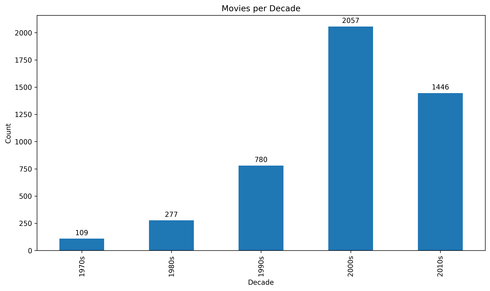

## IMDb End-to-End Data Analysis
An end-to-end analysis of IMDb movie data, combining SQL, Python, and visualization to uncover trends in ratings, genres, budgets, and box-office performance. This project demonstrates how to take raw, unstructured data and transform it into actionable insights, simulating a real-world data workflow. 

---

## Structure 
```
├── data_raw/ # Original source files (CSV, SQLite)
├── data_processed/ # Cleaned & transformed outputs (Parquet, CSV)
├── notebooks/ # Jupyter notebooks for EDA & profiling
├── scripts/ # Python ETL and processing scripts
├── visuals/ # Saved plots and figures
├── requirements.txt # Project dependencies
└── README.md # Documentation
```

---

## Objectives
- Build a reproducible ETL pipeline for raw IMDb data.
- Perform data cleaning/transformation.
- Explore the data through EDA and visualizations.
- Present findings in a way that simulates real-world deliverables.

---

## Current Analysis and Visuals
**Trends Over Time**
- Movies per Decade (with and without labels)
- Ratings by Year (average IMDb ratings over time)
- Budget vs. Revenue by Year (line chart comparison)
- `agg_ratings_by_year.csv`
- `agg_ratings_by_decade.csv`
- `agg_top_actors.csv`

### Sample Visual



**Distribution**
- Movies per Genre (distribution)
- Runtime Distribution (histogram of movie lengths)

**Entity-Level Analysis**
- Top Actors by Film Count
- Directors: Quality and Quantity (ratings vs. film counts)

**Performance Drivers**
- Correlation Analysis (budget, revenue, IMDb rating)

---

## Tools and Libraries
- Python: pandas, matplotlib, seaborn
- SQLite: for structured querying
- Jupyter Notebook: EDA and documentation
- VS Code: Development environment

---

## Future Additions
- Expand SQL queries for deeper exploration.
- Develop decade-level visualizations (e.g., average ratings, budget, revenue).
- Incorporate dashboards in Tableau or Power BI for interactive exploration.
- Perform deeper storytelling analysis around trends (e.g., genre evolution, box
  office success drivers).
- Refine README with visuals, insights, and project flow.
- Add SQL queries directly for data exploration.
- Create a summary report notebook with insights and storytelling.
 
---

## Key Takeaways (so far)
- Clear rise in movie production during the 1990s–2010s.
- Ratings distribution is skewed around 6–7, not bell-shaped.
- Certain genres dominate the dataset more than others.
- Audience ratings have gradually declined over the past decades.
- Larger budgets often correlate with higher revenues, though with significant
  variability.
- A handful of directors (e.g., Spielberg, Scorseses, Coppola) consistently
  combine strong output with high average IMDb ratings.

---

## How to Run
1. Clone the repository
2. Install dependencies:
   ```bash
   pip install -r requirements.txt
3. Run the ETL process: ```python scripts/01_clean_transform.py```
4. Open notebooks to explore analysis:
   - `notebooks/01_data_profile.ipynb` - Dataset profiling & sanity checks.
   - `notebooks/02_classic_analysis.ipynb - SQL queries, visuals and exports. 
    

**This Project is ongoing and will be updated with additional SQL queries, visuals, and dashboards.**
